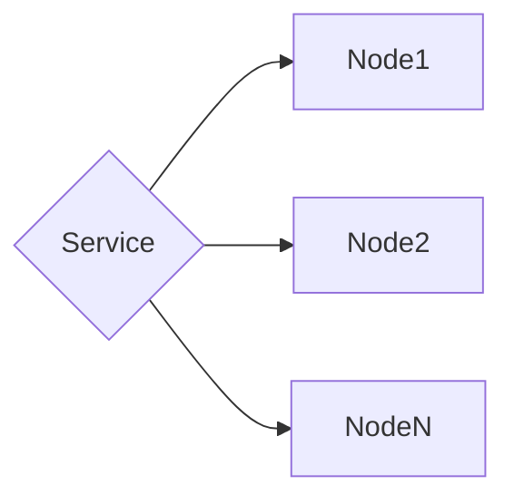

## Cost-Efficiently Running Blockchain Nodes on Kubernetes

### Assessment

An evaluation of the protocol must be undertaken before it is decided that Kubernetes is the ideal fit for running a blockchain client. The following criteria must be considered:

1. Block time
1. Block size
1. Base bandwidth egress as a function of:
```block size * number of blocks in a day * days in a month * GB/month cost```
1. Storage requirements
1. Compute requirements
1. Memory requirements

For example, `bitcoind` and all UTXO protocols derived from its codebase are excellent candidates for running in a Kubernetes cluster on the public cloud because the local storage requirements are low, P2P traffic is predictable and slow compared to more aggressive chains with low block times and large blocks like Solana, and nodes will behave in a stable and deterministic fashion in a load balanced configuration with meager resources (2 vCPU, 8GB RAM). A single deployment of `bitcoind` will run in perpetuity with a maximum possible request capacity of 1024 * N, where N = the number of nodes in the load balancer. The value of 1024 is restricted by the number of open file descriptors in the operatings system -- if this value is increased, the node can handle more concurrent requests, but resources will need to be reassessed and readjusted.

Conversely, Solana is not a viable option for running in Kubernetes in a cost-efficient fashion. The compute and memory requirements alone are demanding, the storage requirements are vast, base bandwidth egress will often top hundreds of terabytes a month in P2P traffic, and it also has additional external requirements in the form of NoSQL storage, which can be satisfied on Google Cloud Platform by plugging into BigQuery (which itself is also expensive).

This document will assume that public access is not required to the nodes, that deployments of each protocol's nodes will be done on the same multi-tenant cluster, and that AWS is the cloud platform provider.

### Network Architecture

A VPC is created to house the infrastructure.

A minimum of three Public and Private Subnets are created, to support a minimum of three protocol node replicas required in order to achieve a basic level of service resilience. More subnet pairs can be added if it is desireable to spread more replicas out across additional Availability Zones.

Consider the instance types available within each Availability Zone, as not all instances types are available within each zone, and the cost of each instance type will vary depending on the region in which it is deployed.

The Public Subnets will receive load balancers for accessing cluster resources from outside the cluster itself (i.e. public-facing applications deployed to the cluster that might communicate with the node services).

The Private Subnets will house the Kubernetes cluster worker members. A NAT Gateway will be deployed to each AZ for cluster workload traffic destined for the public Internet. The NAT Gateway static IPs can be used to allowlist traffic in other parts of the infrastructure.

### Cluster Architecture

AWS EKS clusters can leverage Managed Node Groups, which automate the provisioning lifecycle of Kubernetes cluster worker members. These can in turn be configured to leverage Spot Instances, or unused capacity within Amazon datacenters. The risk is that these nodes may be pre-empted and taken out of service with 2 minutes' notice. The benefit is that it is possible to realize between 55-75% savings on compute when using this type of node.

Installing the AWS Node Termination Handler via Helm chart enables the cluster to receive notification at the moment that pre-emption has been scheduled, and will proactively bring a new node into the cluster, reschedule any processes running on the node scheduled for pre-emption, and destroy it.

The likelihood of more than one node being scheduled for simultaneous termination approaches 0. I have never seen this in ~6 years of running this configuration in high-performance Production environments.

One MNG is created per Availability Zone to ensure that we avoid disrupting the relationship between a pod and its persistent storage across AZs.

### Kubernetes Service Architecture



The protocol nodes are deployed as a StatefulSet. The StatefulSet is configured with Anti-Affinity to avoid scheduling more than one pod per Availability Zone to reduce the risk surface of service availability. It uses `gp3` Persistent Volumes and is front-ended by a Kubernetes service, through which the nodes expose their JSON-RPC endpoints.

Ideally, protocol node scheduling is carefully tuned in such a fashion (perhaps via some combination of custom Annotations paired with Node Selectors) that the software applications consuming data from the nodes are scheduled on the same cluster workers as the blockchain clients themselves -- this results in $0 spent on bandwidth transfer between these applications.

Requests ingress through the Kubernetes Service and are round-robined to the nodes. Because there are at least 3 nodes, rolling upgrades/restarts or cluster worker member pre-emptions do not pose a threat to the external stability of the service. A Horizontal Pod Autoscaler can also be configured to add or remove capacity as traffic or pod availability fluctuates.

Ideally, the blockchain clients expose health endpoints via HTTP such that we can implement intelligent Liveness and Readiness checks. Under ideal conditions, Liveness would correspond to a `/health` endpoint that returns HTTP 200 when the process is running, and Readiness would manifest in the form of a script that checks the reported sync state of the node, checks the reported block height against third-party block explorers or other nodes on the cluster, and perhaps the number of connected peers.

For blockchains that are heavily config-driven (such as Tendermint), configuration files can be sourced directly from the Git repository, deployed to the cluster as ConfigMaps, and mounted to the filesystem at deploy time. In this fashion, we can version our blockchain client configurations.

### Repository Architecture

The repository contains both the Infrastructure-as-Code that defines the Kubernetes deployment on the cluster, as well as the `Dockerfile` used to build the container image, and any configuration files that need to be mounted at runtime. In so doing, anyone with access to the repository can upgrade or pin protocol versions, increase resource allocations, change environment variables, or reconfigure blockchain node behavior by simply submitting a PR to the repository and running CI.

### Bonus Savings

A customer of AWS can establish an Enterprise Discount Plan (EDP) with Amazon, which is a commitment to spend a certain amount of money over a static amount of time. In return, Amazon will allot a flat single digit of savings to all spend. This also includes subscriptions made in the AWS Marketplace, where not only will the discount apply, but the spend for those subscriptions will be counted toward the commit. EDPs can be tuned specifically for storage and egress consumption, which tend to be the two highest cost centers after solving for compute as above.